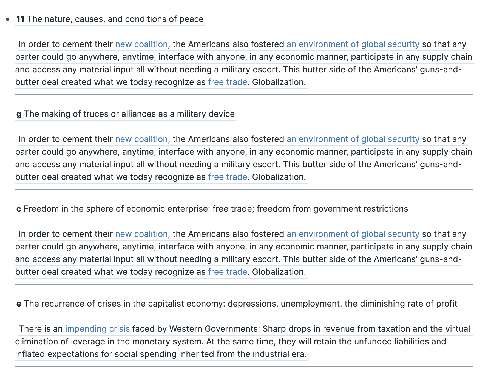

# Refs

A component to render blocks that __reference__ a given block and it's children.

## Motivation

Mortimar Adler considered the Western canon to be one "great conversation," and enumerated a list of more than 100 "Great Ideas" (things like "Education", "Family", "State" and "Wealth"), each of which were outlined and indexed to sections of the __Great Books of the Western World__.

I've found it fun and useful to link things that I read with the points that comprise these Great Ideas, which I keep as a [single page in Roam](https://roamresearch.com/#/app/chm-demo/page/_n27ziq13) so that it's easy to share with others.

That left me wondering: How can I view the full "conversation"? This component is one attempt at an answer, allowing me to render all the blocks which reference any block on my `GREAT IDEAS` page.

## Usage

1. Add a block reference of any GREAT IDEA block to anything else in your graph.

2. Render the component anwhere in your graph, passing in an `ident` for the highest-level "parent".

