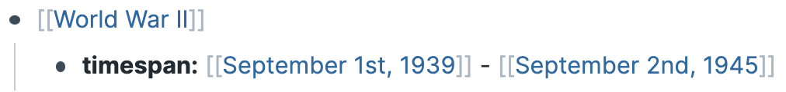

# Timespan

A component to track events that span multiple days/months/years on Daily Notes pages.

## Usage

1. Nest a `timespan::` attribute below any block, followed by start date and end date (optional) that match the following pattern: `[[September 1st, 1939]] - [[September 2nd, 1945]]`.

Example:

2. Navigate to any Daily Notes page within a timespan and render the component.

[Loom Demo](https://www.loom.com/share/53916441a779498f9c72c0e45e07d455)
